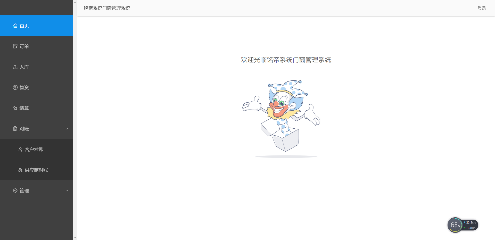
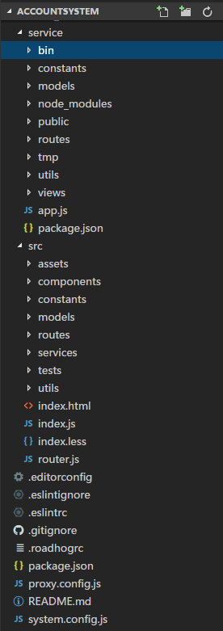
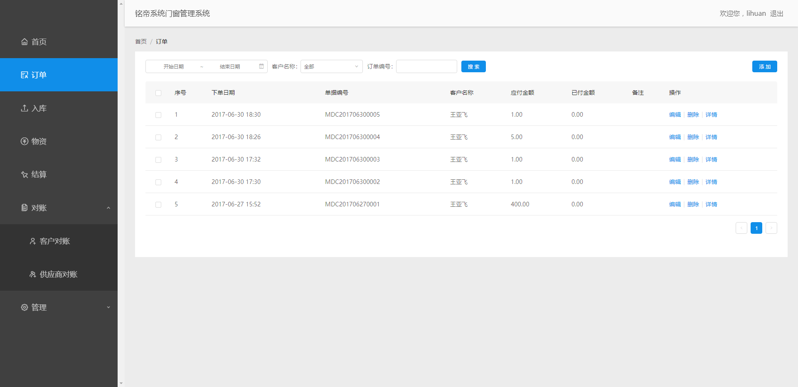
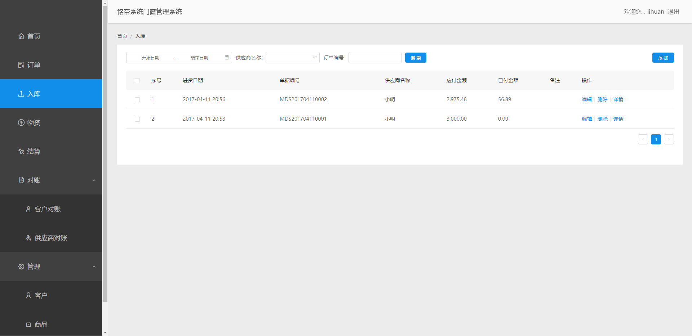
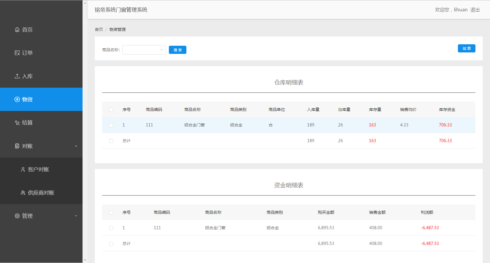
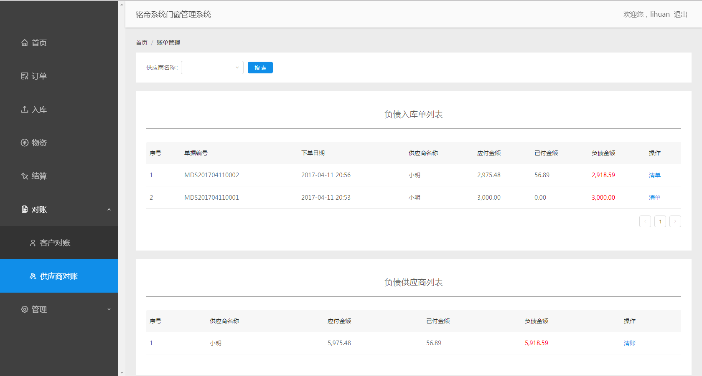

## AccountSystem 一个小型库存管理系统

 

 

## 如何安装
1`.` 请确保安装MongoDB并正确启动( mongodb相关资料请移步[这里](https://docs.mongodb.com/manual/installation/) ) 
2`.` 请确保全局安装pm2 `npm install -g pm2` 
3`.` Clone 该项目到本地 `git clone https://github.com/yvanwangl/AccountSystem.git` 
4`.` 安装依赖包 `npm install` 
5`.` 该项目采用前后端分离模式开发，如果要在开发模式运行则执行以下命令： 
    * 启动node server开发服务 `npm run start:dev` 
    * 启动前端dev server `npm start` 
6`.` 如果以发布模式运行则执行以下命令： 
    * 前端资源打包 `npm run build` 
    * 启动node server部署服务 `npm run start:prod` 

## 项目技术栈
前端技术：React + React-Router + Redux + React-Redux + Redux-Saga + Webpack 
前端脚手架：[dva](https://github.com/dvajs/dva) 
UI组件库：[ant-design](https://github.com/ant-design/ant-design) 
后端技术：Express + Mongoose 

该项目采用前后端分离技术，前端使用React全家桶，项目整体框架使用dva，dva是一个将redux、redux-saga 和 react-router 等进行封装的前端框架，方便项目配置及代码管理；后端使用express + mongoose 进行后端业务处理及数据库操作。 

## 实现功能
1`.` 登录注册功能 
2`.` 基础数据管理功能，包括：客户管理、商品管理、供应商管理 
3`.` 订单及进货单管理功能，包括：订单管理、入库管理 
4`.` 物资管理功能 
5`.` 结算管理功能 
6`.` 账单管理功能，包括：客户对账管理、供应商对账管理 

## 项目结构
 

## 订单管理
订单管理包括增加、修改、删除及查看订单详情，可以根据订单生成日期、客户名称及订单编号进行查询，订单编号支持模糊查询 
 

## 入库管理
入库管理包括增加、修改、删除及查看入库单详情的功能，可根据入库单生成日期、供应商名称及入库单编号进行查询，入库单编号支持模糊查询 
 

## 物资管理
物资管理将仓库库存的物资和资金进行分类统计，可以查看仓库中当前剩余的商品的种类和数量；资金管理从商品分类的角度对系统流出资金和流入资金进行统计汇总，方便查看不同商品对应的资金情况。 
 

## 对账管理——供应商对账
供应商对账管理从负债入库单和负债供应商两个角度对负债账务进行分类，同时可以根据供应商的名称对负债入库账单和负债供应商进行过滤。从两个角度进行分类统计是为了方便能够按照入库单进行分批清账，或直接向供应商清账，方便账务分类管理 
 

其他一些界面的功能就不再一一介绍，感兴趣的话自己clone一份代码，运行一下便知:) 

#### 欢迎Star！ 

